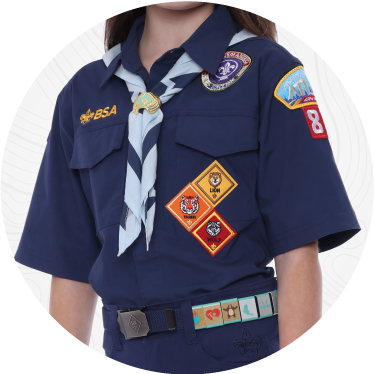
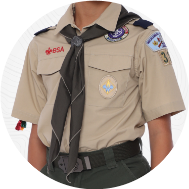

# New Scout Welcome Email: Bobcat Ceremony and How to Get Ready

- **Audience:** New Pack 149 families
- **When to send:** A few weeks before the Bobcat Ceremony pack meeting
- **How to send:** To info@bsapack149.org, with pack leaders in Cc and new families in Bcc so family addresses stay private
- **First sent:** September 2026

---

**Subject:** Welcome New Pack 149 Families - Bobcat Ceremony and How to Get Ready

---

Hi New Pack 149 Families,

Welcome to Pack 149! We are so excited your family has joined us. We can't wait to share a year full of campouts, Pinewood Derby, the Holiday Bazaar, and lots of fun with your scout.

Our first big event together is the **Bobcat Ceremony Pack Meeting on [BOBCAT DAY AND DATE] at [BOBCAT TIME]** in the Spicewood Elementary cafeteria. Below is everything you need to get your scout ready.

### Uniforms: What to Wear and When

**Lions (Kindergarten):** Lions do not wear the Class A uniform yet. They only need the navy Lion t-shirt. The Class A uniform starts at the Tiger rank in 1st grade.

**Tigers (1st Grade), Wolves (2nd Grade), Bears (3rd Grade), and Webelos (4th Grade)** wear the blue "Class A" shirts. **Arrow of Light scouts (5th grade)** wear the tan Class A shirts. We highly recommend buying a size up for scout uniforms since your scout will wear the Class A from 1st to 4th grade.

 

**Class A (Field Uniform):** Worn at all pack meetings and pack events, and when traveling as a pack, unless we let you know otherwise. **Scouts will need their Class A uniform by the [BOBCAT DATE] Bobcat Ceremony.** Neckerchiefs are provided by the pack.

**Class B (Activity Uniform):** The navy Pack 149 t-shirt with the Austin skyline. Scouts can wear this to den meetings and den events. Every scout receives a Class B shirt as part of joining Pack 149.

Pack 149 is a **"waist-up" uniform pack**. Scouts wear the uniform shirt and neckerchief. Any belt, pants, or shorts are fine. You can buy the official belt and pants from the scout shop if desired, but it isn't required.

### How to Get the Class A Uniform and the Lion T-Shirt

**Option 1: Visit the Scout Shop in person (recommended)**

Steve Matthews Scout Shop (Capitol Area Council)\
[12500 North IH 35, Austin, TX 78753](https://maps.google.com/?q=12500+North+IH+35,+Austin,+TX+78753)\
Phone: 512-617-8630\
Hours: [capitolareascouting.org/about/shop-info](https://www.capitolareascouting.org/about/shop-info/)

The big advantage of buying in person is that the council badges come already sewn on, which saves you some work. The employees at the scout shop are also very knowledgeable and are happy to help.

**Option 2: Order online**

Scouting America also sells uniforms and patches online at <https://www.scoutshop.org/cub-scout-collection> and ships by USPS. If you order online, please allow time for shipping so the uniform arrives before [BOBCAT DATE].

### Badges to Add

A few badges need to be purchased and sewn on (all available at the Scout Shop):

- Pack number **149**
- Capitol Area Council patch (already sewn on if you buy from the scout shop)
- Your scout's **den number** (ask your den leader if you're not sure)

Not sure where everything goes? The badge placement guide is on our Pack Resources page: [bsapack149.org/pack-resources.html](https://www.bsapack149.org/pack-resources.html)

### Getting Ready for Bobcat

Part of earning the Bobcat is knowing the Scout Oath, Scout Law, and Cub Scout Motto. Please review these with your scout before the [BOBCAT DATE] meeting, and talk together about what they mean. Lions don't need to know them by heart, but they should understand the meaning behind them.

**Scout Oath**

On my honor I will do my best\
To do my duty to God and my country\
and to obey the Scout Law;\
To help other people at all times;\
To keep myself physically strong,\
mentally awake, and morally straight.

**Scout Law**

A Scout is trustworthy, loyal, helpful, friendly, courteous, kind, obedient, cheerful, thrifty, brave, clean, and reverent.

**Cub Scout Motto**

Do Your Best.

### Questions?

If you have any questions, please reach out to your den leader. If you don't know how to reach your den leader, contact [CONTACT NAME] at [CONTACT EMAIL] or [CONTACT PHONE] to get connected.

Many of the basics about our organization, uniform requirements, and advancement details can be found on our website's About Us page: <https://www.bsapack149.org/about.html>

We're so glad you're here and can't wait to see everyone on [BOBCAT DATE]!

Yours in Scouting,\
[SENDER NAME]\
Cell: [SENDER PHONE]

--------------

*Scouts! In keeping with Youth Protection's no one-on-one contact rule, please remember to CC your parents/guardians or two adult leaders when communicating electronically.*

*Adults! In keeping with Youth Protection's no one-on-one contact rule, please remember to CC any Scouting youth's parents/guardians or another adult leader if you include a Scouting youth in a reply.*
